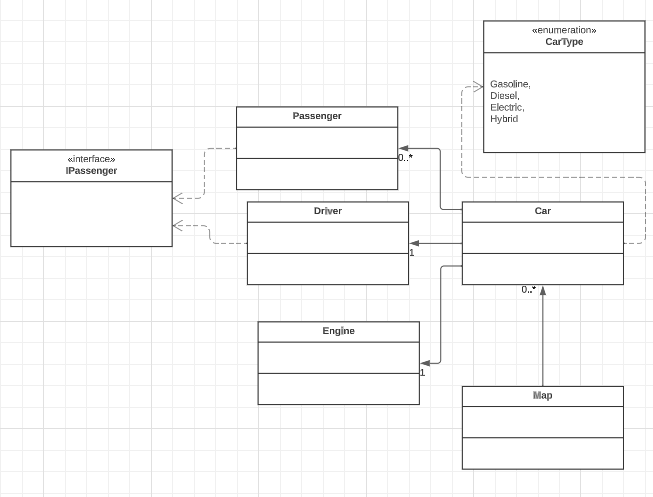

# Проект "Система Управління Автомобілями"

## Опис

Цей проект створено з метою моделювання системи управління автомобілями. Система дозволяє додавати автомобілі на карту, переміщати їх, враховуючи позицію та дальність переміщення, а також управляти пасажирами і водіями.

### Основні Компоненти

- **Автомобіль (Car)**: Основний клас, який представляє автомобіль з водієм, пасажирами, двигуном та позицією на карті.
- **Водій (Driver)** і **Пасажир (Passenger)**: Класи, що реалізують інтерфейс `IPassenger`. Вони представляють людей, які можуть займати місця в автомобілі.
- **Двигун (Engine)**: Клас, що представляє двигун автомобіля, з можливістю визначення дальності переміщення.
- **Карта (Map)**: Клас, що представляє двовимірну карту, на якій автомобілі можуть переміщатися.

### Функціональність

1. **Додавання Автомобіля на Карту**: Можливість розміщення автомобіля на певній позиції.
2. **Переміщення Автомобіля**: Автомобіль може переміщатися горизонтально, вертикально та діагонально в межах заданої дальності.
3. **Управління Пасажирами**: Додавання та видалення пасажирів з автомобіля.
4. **Детекція Зіткнення**: При спробі переміщення в клітинку, де вже є інший автомобіль, обидва автомобілі видаляються з карти.

## Діаграма Класів

Тут ви можете побачити діаграму класів, яка відображає структуру нашої системи:

